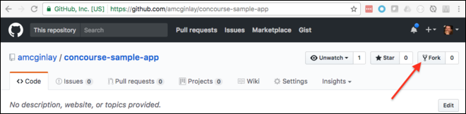

# concourse-getting-started
### What's the least I have to do to get Concourse running?

Download VirtualBox and check version (min 5.1)

```
brew cask install virtualbox
vboxmanage --version
```

Download bosh CLI v2 and check version (min 2.0)

```
brew install cloudfoundry/tap/bosh-cli
bosh2 --version
```

Grab the offical deployment files and create a new folder for our deployments

```
REPO_BOSH=cloudfoundry/bosh-deployment
git clone https://github.com/$REPO_BOSH ~/src/$REPO_BOSH/
cd ~/src/$REPO_BOSH/ && mkdir ./deployments/
```

Create the BOSH Lite Director VM (this may take a few minutes)

```
# assuming working directory is ~/src/$REPO_BOSH/
bosh2 create-env ./bosh.yml \
  --state ./deployments/state.json \
  -o ./virtualbox/cpi.yml \
  -o ./virtualbox/outbound-network.yml \
  -o ./bosh-lite.yml \
  -o ./bosh-lite-runc.yml \
  -o ./jumpbox-user.yml \
  --vars-store ./deployments/creds.yml \
  -v director_name="Bosh Lite Director" \
  -v internal_ip=192.168.50.6 \
  -v internal_gw=192.168.50.1 \
  -v internal_cidr=192.168.50.0/24 \
  -v outbound_network_name=NatNetwork
```

Set up an alias named `vbox` for the BOSH Lite Director VM and confirm it worked

```
bosh2 -e 192.168.50.6 --ca-cert <(bosh2 int ~/src/$REPO_BOSH/deployments/creds.yml --path /director_ssl/ca) alias-env vbox
bosh2 environments # NOTE the '192' IP Address
curl -k https://192.168.50.6:25555/info
```

Configure environment variables for your login credentials and confirm this worked (remember if you move to a new terminal window you'll need to recreate these)

```
export BOSH_CLIENT=admin
export BOSH_CLIENT_SECRET=`bosh2 int ~/src/$REPO_BOSH/deployments/creds.yml --path /admin_password`
bosh2 -e vbox environment
```

Upload a suitable stemcell and check it

```
bosh2 -e vbox upload-stemcell https://bosh.io/d/stemcells/bosh-warden-boshlite-ubuntu-trusty-go_agent?v=3421.11
bosh2 -e vbox stemcells
```

Upload `Concourse` and `Garden-runC` releases then check them

```
bosh2 -e vbox upload-release https://bosh.io/d/github.com/concourse/concourse?v=3.3.2
bosh2 -e vbox upload-release https://bosh.io/d/github.com/cloudfoundry/garden-runc-release?v=1.9.0
bosh2 -e vbox releases
```

Grab the `concourse-getting-started` repo.

```
REPO_STARTER=amcginlay/concourse-getting-started
git clone https://github.com/$REPO_STARTER ~/src/$REPO_STARTER/
```

Update the cloud configuration and check it.  This contains the IAAS specific information.

```
bosh2 -e vbox update-cloud-config ~/src/$REPO_STARTER/cloud-config.yml
bosh2 -e vbox cloud-config
```

Deploy `Concourse` and check it (this may take a few minutes)

```
bosh2 -e vbox -d concourse deploy ~/src/$REPO_STARTER/concourse.yml
bosh2 -e vbox deployments
```

Ensure Concourse is reachable from a browser ...

```
open http://10.244.8.2:8080/
```

... if not you should open up the '10.244' routes for BOSH Lite and retry.  NOTE the '192' IP is the one we allocated for the BOSH Lite Director VM earlier.

```
sudo route delete -net 10.244.0.0/16
sudo route add -net 10.244.0.0/16 192.168.50.6
netstat -rn | grep 10.244 # ensure route set correctly
```

Follow the browser prompts to download the Concourse CLI tool named `fly` then install it on the path and check it.

```
install ~/Downloads/fly /usr/local/bin
fly --version
```

Now login to Concourse and check

```
fly -t concourse login --concourse-url http://10.244.8.2:8080
fly targets
```

Follow the warning prompts to re-sync `fly` if necessary

```
fly -t concourse sync
```

Fork the sample app at `https://github.com/amcginlay/concourse-sample-app`.



Grab your forked sample app which will help us complete this exercise.

```
REPO_SAMPLE=[YOUR_GITHUB_USERNAME]/concourse-sample-app
git clone https://github.com/$REPO_SAMPLE ~/src/$REPO_SAMPLE/
```

Information telling Concourse how to build and deploy the sample app is contained in the `$REPO_SAMPLE/ci` directory.  Copy and rename the example config file.  This new file named `private.yml` needs to contain your **real PWS/PCF login credentials**.

```
cd ~/src/$REPO_SAMPLE/ci/
cp ./private.yml.example ./private.yml
```

Once your credentials are set in the `private.yml` file, set the pipeline, check it then unpause it

```
# assuming working directory is ~/src/$REPO_SAMPLE/ci/
fly -t concourse set-pipeline -p concourse-sample-app-pipeline -c ./pipeline.yml -l ./private.yml
fly -t concourse pipelines
fly -t concourse unpause-pipeline -p concourse-sample-app-pipeline
```

Return to the webpage at `http://10.244.8.2:8080`.  CLick `login` and select the `main`.  

You should now see a visual representation of our `pipeline` with the `build` job sandwiched between our two `resources` which fetch the source-code from git and push the artifact to Cloud Foundry respectively.  Concourse can handle multiple pipelines and these are listed behind the hamburger icon in the top-left hand corner.

Because the git resource is a trigger dependency (indicated by a solid line between the `resource` and the `build` job) the `build` process will be automatically activated when it's unpaused and once again any time changes are commited and pushed to the `concourse-sample-app` git repo.

If you want to remove the trigger between the build job and it's dependency, remove the following line from `pipeline.yml` then re-issue the `set-pipeline` and `unpause-pipeline` commands as before.  The solid line between these components will now show as a dotted line.

```
trigger: true
```

To manually trigger the job from the webpage select the `build` job and click the `+` button.  Alternatively you can issue the following command.  Note that the job is qualified by its pipeline name.

```
fly -t concourse trigger-job -j concourse-sample-app-pipeline/build-artifact-job -w
```

Once the build goes green you should have a new or updated app in Cloud Foundry.  Use the Apps Manager or the `cf cli` to confirm this as follows.

```
cf apps
```

### Task Complete!
