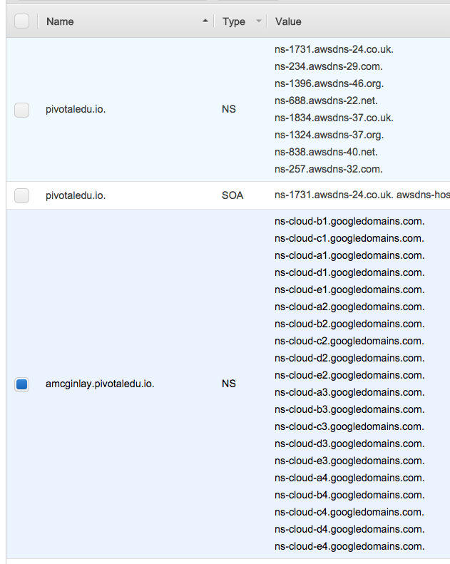

# concourse-getting-started

# What's the absolute minimum I have to do to get Concourse running on GCP?

## Install A Jumpbox

### Set Up Variables On Local Machine

```
GCP_PROJECT_ID=<TARGET_GCP_PROJECT_ID>
```

### Authenticate Local Machine

```
gcloud auth login --quiet
```

### Create Jumpbox VM From Local Machine

```
gcloud services enable compute.googleapis.com

gcloud compute instances create "jbox-concourse" \
  --image-project "ubuntu-os-cloud" \
  --image-family "ubuntu-1804-lts" \
  --boot-disk-size "200" \
  --machine-type=g1-small \
  --project "${GCP_PROJECT_ID}" \
  --zone "us-central1-a"
```

### SSH To Jumpbox

```
gcloud compute ssh ubuntu@jbox-concourse \
  --project "${GCP_PROJECT_ID}" \
  --zone "us-central1-a"
```

### Install Essential Jumpbox Tools

Elevate privileges:

```bash
sudo su -
```

Install tools:

```
apt update && apt --yes install unzip make ruby

wget -O terraform.zip https://releases.hashicorp.com/terraform/0.11.8/terraform_0.11.8_linux_amd64.zip && \
  unzip terraform.zip && \
  mv terraform /usr/local/bin
  
wget -O bosh https://s3.amazonaws.com/bosh-cli-artifacts/bosh-cli-5.3.1-linux-amd64 && \
  chmod +x bosh && \
  mv bosh /usr/local/bin/

wget -O bbl https://github.com/cloudfoundry/bosh-bootloader/releases/download/v6.9.0/bbl-v6.9.0_linux_x86-64 && \
  chmod +x bbl && \
  sudo mv bbl /usr/local/bin/
```

Verify that these tools were installed:

```bash
which unzip; which make; which ruby; which terraform; which bosh; which bbl
```

Remember to return to the shell with regular privileges:

```bash
exit
```

### Authenticate Jumpbox

Follow the on-screen prompts as your execute the following:

```
gcloud auth login --quiet
```

### Setup Jumpbox Variables

In the ubuntu home directory on your jumpbox, create a hidden file named `.env` to store variables, the values of which describe your specific environment. You should customize the `.env` file to suit your target environment before continuing.

Take the template `.env` file below and substitute in the proper values for your GCP project:

```
CC_DOMAIN_NAME=CHANGE_ME_DOMAIN_NAME                 # e.g. pivotaledu.io
CC_SUBDOMAIN_NAME=CHANGE_ME_SUBDOMAIN_NAME           # e.g. cls99env66

CC_EXTERNAL_URL=http://concourse.${CC_SUBDOMAIN_NAME}.${CC_DOMAIN_NAME}
```

### Persist Your Environment File

Now that we have the `.env` file with our critical variables, we need to ensure that these get set into the shell, both now and every subsequent time the ubuntu user connects to the jumpbox.

```bash
source ~/.env
echo "source ~/.env" >> ~/.bashrc
```

### Increase GCP Quotas

If necessary, increase GCP project quotas (`IAM & admin -> Quotas`) for the __us-central1__ region as follows:

Quota type               | Quota Amount
------------------------ | ------------
CPU                      | 100
Persistent Disk SSD (GB) | 1000
In-use IP addresses      | 32

### BOSH Bootloader (BBL)

BBL will generate some files, so create a home for this operation and move there:
```
mkdir ~/bbl-concourse && cd ~/bbl-concourse
```

Create a service account for BBL
```
gcloud iam service-accounts create bbl-service-account \
  --display-name "BBL service account"
gcloud iam service-accounts keys create \
  --iam-account="bbl-service-account@$(gcloud config get-value core/project).iam.gserviceaccount.com" \
  bbl-service-account.json
gcloud projects add-iam-policy-binding $(gcloud config get-value core/project) \
  --member="serviceAccount:bbl-service-account@$(gcloud config get-value core/project).iam.gserviceaccount.com" \
  --role="roles/editor"
```

Execute BBL to build Jumpbox and BOSH director VM.  
**Note** this also sets the BOSH Director's `cloud config`:
```
# if next step fails due to "too many authentication failures" 
# condsider adding "IdentitiesOnly=yes" to ~/.ssh/config
bbl up \
  --name concourse \
  --lb-type concourse \
  --iaas gcp \
  --gcp-region us-central1 \
  --gcp-service-account-key $HOME/bbl-concourse/bbl-service-account.json
```

Extract the external URL and credentials:
```
CC_LB_IP=$(bbl lbs | awk -F': ' '{print $2}')
eval "$(bbl print-env)"
```

### Deploy Concourse

Upload a stemcell:
```
bosh upload-stemcell https://bosh.io/d/stemcells/bosh-google-kvm-ubuntu-xenial-go_agent
```

Deploy Concourse:
```
git clone https://github.com/concourse/concourse-deployment.git ~/bbl-concourse/concourse-deployment/
cd ~/bbl-concourse/concourse-deployment/cluster/

cat >secrets.yml <<EOL
local_user:
  username: admin
  password: adm1npa55w0rd
EOL

bosh deploy -n -d concourse concourse.yml \
  -l ../versions.yml \
  -l secrets.yml \
  --vars-store cluster-creds.yml \
  -o operations/basic-auth.yml \
  -o operations/privileged-http.yml \
  -o operations/privileged-https.yml \
  -o operations/web-network-extension.yml \
  --var network_name=default \
  --var external_url=$CC_EXTERNAL_URL \
  --var web_vm_type=default \
  --var db_vm_type=default \
  --var db_persistent_disk_type=100GB \
  --var worker_vm_type=default \
  --var deployment_name=concourse \
  --var web_network_name=private \
  --var web_network_vm_extension=lb
```

### Configure DNS

```
gcloud services enable dns.googleapis.com

gcloud dns managed-zones create concourse \
  --dns-name=${CC_SUBDOMAIN_NAME}.${CC_DOMAIN_NAME} \
  --description=

gcloud dns record-sets transaction start --zone=concourse

  gcloud dns record-sets transaction \
    add ${CC_LB_IP} \
    --name=concourse.${CC_SUBDOMAIN_NAME}.${CC_DOMAIN_NAME}. \
    --ttl=60 --type=A --zone=concourse

gcloud dns record-sets transaction execute --zone=concourse
```

### Verify DNS

Once `dig` can resolve the Concourse URL to an IP address, we're good to move on.

```bash
watch dig concourse.${CC_SUBDOMAIN_NAME}.${CC_DOMAIN_NAME}.
```

This step is dependent on attaching a ${CC_SUBDOMAIN_NAME}.${CC_DOMAIN_NAME} NS record-set to your registered domain.  This record-set must point to _every_ google domain server, for example:

(screenshot from [AWS Route 53](https://aws.amazon.com/route53))



### Navigate To Concourse And Download `fly`

Navigate to the Concourse web UI and download the `fly` CLI utils for the OS of your local machine.

From your local machine, log-in via the `fly` CLI:
```
fly -t concourse login -c http://concourse.${CC_SUBDOMAIN_NAME}.${CC_DOMAIN_NAME} # NOTE http, not https !!!
```

Now follow the [IaaS independent instructions](../shared/README.md) to create your first pipeline.

### Task Complete!
