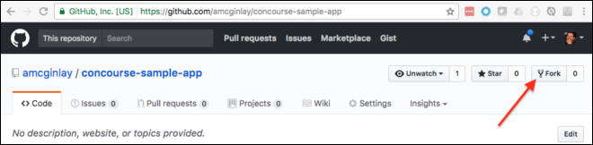

# concourse-getting-started
### Creating your first pipeline (IaaS independent)

These instructions assume you've already followed one of the IaaS-specific paths to stand up a Concourse instance and the `fly` CLI is logged in to it.

Fork the sample app at [https://github.com/amcginlay/concourse-sample-app](https://github.com/amcginlay/concourse-sample-app).



Grab your forked sample app which will help us complete this exercise.

```
REPO_SAMPLE=[YOUR_GITHUB_USERNAME]/concourse-sample-app
git clone https://github.com/$REPO_SAMPLE ~/src/$REPO_SAMPLE/
```

Information telling Concourse how to build and deploy the sample app is contained in the `$REPO_SAMPLE/ci` directory.  Copy and rename the example config file.  This new file named `private.yml` needs to contain your **real PWS/PCF login credentials**.

```
cd ~/src/$REPO_SAMPLE/ci/
cp ./private.yml.example ./private.yml
```

Once your credentials are set in the `private.yml` file, set the pipeline, check it then unpause it

```
# assuming working directory is ~/src/$REPO_SAMPLE/ci/
fly -t concourse set-pipeline -p concourse-sample-app-pipeline -c ./pipeline.yml -l ./private.yml
fly -t concourse pipelines
fly -t concourse unpause-pipeline -p concourse-sample-app-pipeline
```

Return to the webpage at [http://10.244.8.2:8080](http://10.244.8.2:8080).  Click `login` and select the `main`.  

You should now see a visual representation of our `pipeline` with the `build` job sandwiched between our two `resources` which fetch the source-code from git and push the artifact to Cloud Foundry respectively.  Concourse can handle multiple pipelines and these are listed behind the hamburger icon in the top-left hand corner.

Because the git resource is a trigger dependency (indicated by a solid line between the `resource` and the `build` job) the `build` process will be automatically activated when it's unpaused and once again any time changes are commited and pushed to the `concourse-sample-app` git repo.

If you want to remove the trigger between the build job and it's dependency, remove the following line from `pipeline.yml` then re-issue the `set-pipeline` and `unpause-pipeline` commands as before.  The solid line between these components will now show as a dotted line.

```
trigger: true
```

To manually trigger the job from the webpage select the `build` job and click the `+` button.  Alternatively you can issue the following command.  Note that the job is qualified by its pipeline name.

```
fly -t concourse trigger-job -j concourse-sample-app-pipeline/build-artifact-job -w
```

Once the build goes green you should have a new or updated app in Cloud Foundry.  Use the Apps Manager or the `cf cli` to confirm this as follows.

```
cf apps
```

### Task Complete!
